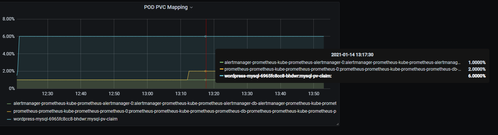

# pvc-exporter

[](https://opensource.org/licenses/Apache-2.0)
[](https://sonarcloud.io/dashboard?id=balihb_pvc-exporter)
[](https://github.com/balihb/pvc-exporter/actions/workflows/release.yaml)
[](https://artifacthub.io/packages/search?repo=balihb-pvc-exporter)

This item provides 2 metrics, one for monitoring mounted PVC usage on nodes (block_pvc_scanner), and one to provide the mapping of for PODs and PVCs (pod_pvc_mapping).

Block_pvc_scanner can be turned off completely since new prometheus-node-exporters can export PVC usage as well. In that case the defaultDashboard query would change to something like this:

```
label_join((sum without (pod,service,job,instance,endpoint) (kubelet_volume_stats_used_bytes{job="kubelet",metrics_path="/metrics",namespace=~".*"})) + on(namespace, persistentvolumeclaim) group_left(mountedby)label_replace(pvc_mapping, "namespace", "$1", "ns", "(.*)")*0,"pod_pvc"," : ","namespace","mountedby","persistentvolumeclaim")
```

## Note

Only used to monitor mounted pvc that provided by block storage provisioner. Such as longgorn, trident, rook-ceph, etc...

## Support list

The following storage provisioners has been tested...
1. longgorn
2. trident
3. rook-ceph
4. aliyun flexvolume
5. iomesh
6. nutanix-csi

## Usage

```shell
helm repo add pvc-exporter https://balihb.github.io/pvc-exporter/
helm install my-pvc-exporter pvc-exporter/pvc-exporter --version xxx
```

## Grafana

You can import the pvc_usage-dashboard to grafana to monitor pvc usage.

The format for legend is pod:pvc.
